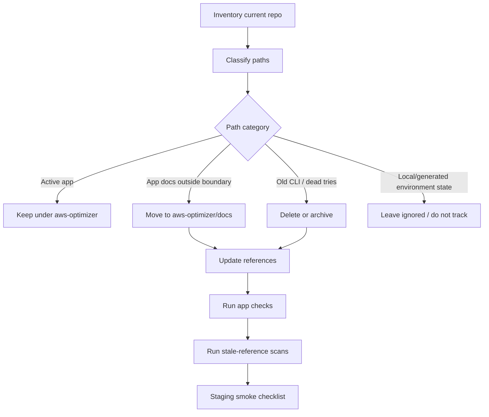

# refactor: Make aws-optimizer the only app surface

## Overview

Clean the repository so `aws-optimizer/` is the only active application boundary. The cleanup should remove the stale root Cloutive/Codebuff CLI surface, preserve app-relevant operational knowledge, and make onboarding/build/deploy docs point to the npm-workspace app under `aws-optimizer/`.

The lowest-risk interpretation of the request is: keep `aws-optimizer/` as the nested app root and delete/archive old root-level tries. Do **not** flatten `aws-optimizer/` into repository root in this plan; flattening would require a separate path-migration plan for deploy scripts, workspaces, lockfiles, and documentation.

---

## Problem Frame

The repository currently has two conflicting identities:

- The real app is `aws-optimizer/`: React/Vite web app, Convex backend, Cloudflare Worker frontend proxy, and Cloudflare Container sandbox.
- The repository root still contains stale material from an older Bun/Codebuff CLI and one-off report-generation tries: `src/`, root `README.md` CLI sections, `knowledge.md`, `SOUL.md`, `IDENTITY.md`, `sample-serkan/`, and `artifacts/`.

This creates onboarding risk, deploy confusion, stale environment variable references (`CODEBUFF_API_KEY`, `SANDBOX_URL` vs `SANDBOX_WORKER_URL`), and makes it hard to tell which files belong to the product.

---

## Requirements Trace

- R1. `aws-optimizer/` remains the only active app source tree and npm workspace root.
- R2. Stale root CLI source and docs are removed or clearly archived so developers cannot follow broken Bun/Codebuff flows.
- R3. App-relevant operational docs are preserved under the app boundary, not lost during cleanup.
- R4. Build, test, Convex sync, and deploy commands remain valid after moving/deleting files.
- R5. Public docs consistently describe the current app, canonical commands, environment variables, and deployment boundaries.
- R6. Cleanup includes static reference scans so dead references are removed, not just dead files.
- R7. Production/staging deployment caveats are preserved, especially the Cloudflare Containers blocker and incomplete production Convex setup.

---

## Scope Boundaries

- Do not flatten `aws-optimizer/` into repository root in this cleanup pass.
- Do not change product behavior, UI flows, Convex schema, billing, auth, or sandbox execution logic except for docs/config naming cleanup.
- Do not delete generated Convex files under `aws-optimizer/packages/convex/convex/_generated/` or `aws-optimizer/packages/convex/convex/betterAuth/_generated/`.
- Do not claim production is ready; current docs show production Convex and sandbox deployment are still blocked/incomplete.
- Do not remove local-only auth/config directories from Git unless they are tracked; `.convex/`, `.devenv/`, `.direnv/`, `.env.local`, and `node_modules/` are environment state, not app source.

### Deferred to Follow-Up Work

- Flattening `aws-optimizer/` to repo root: separate migration plan if desired later.
- Product rename decision across “AWS Manager” and “AWS Optimizer”: this cleanup removes stale Cloutive/Codebuff identity only; broader product naming decisions can follow.
- Production Convex separation: separate deployment/setup task once production deployment URL and `CONVEX_DEPLOY_KEY` are available.
- Internal app dead-file cleanup that is not needed to remove the old root app surface: optional follow-up unless a file creates onboarding or app-boundary confusion.

---

## Context & Research

### Relevant Code and Patterns

- `aws-optimizer/package.json` is the active npm workspace root with scripts: `dev`, `build`, `lint`, `typecheck`, `check:convex`.
- `aws-optimizer/apps/web/package.json` owns React/Vite, worker build, tests, and `deploy.sh` wrappers.
- `aws-optimizer/apps/sandbox/package.json` owns Cloudflare sandbox worker/container scripts.
- `aws-optimizer/packages/convex/package.json` owns Convex backend dev/deploy/typecheck/test scripts.
- `aws-optimizer/apps/web/deploy.sh` computes paths relative to the nested app layout; keeping `aws-optimizer/` nested avoids unnecessary deploy-script churn.
- `aws-optimizer/apps/web/wrangler.jsonc` currently points staging and production vars at `https://quirky-sparrow-76.convex.cloud`.
- `aws-optimizer/packages/convex/convex/sandbox.ts` uses `SANDBOX_WORKER_URL`; root/app docs still mention `SANDBOX_URL` in places.
- Root `src/` imports `@codebuff/sdk`, `commander`, `chalk`, `ora`, and Bun-oriented flows, but no root `package.json` exists.

### Institutional Learnings

- `docs/TEAMTODO.md` contains live deployment blockers and must be preserved or moved before deleting root docs.
- `docs/prod.txt` contains current Cloudflare/Convex migration state and must be preserved or moved.
- `docs/perm_requirements.md` is app-relevant AWS onboarding content referenced from `aws-optimizer/README.md`.
- `docs/convex-scripts-best-practices.md` is app-relevant Convex maintenance guidance.
- `sample-serkan/`, `artifacts/`, and `docs/AWS_ANALYSIS_TEMPLATE.md` are tied to older report-generation experiments; keep only if intentionally re-homed as archived reference material.

### External References

- External research was not needed. The cleanup is governed by local repository structure, deployment scripts, and documented environment state.

---

## Key Technical Decisions

- Keep `aws-optimizer/` nested as the app root: minimizes risk because workspaces, lockfiles, deploy scripts, and imports already assume this shape.
- Preserve operational docs by moving/copying them under `aws-optimizer/docs/` before deleting root stale docs: avoids losing active deployment state.
- Delete the stale root CLI source rather than maintaining a shim: there is no root manifest, the CLI is not buildable, and the user wants only the `aws-optimizer` app surface.
- Treat stale-reference scans as first-class verification: tests will not catch broken prose or old onboarding commands.
- Separate cleanup from production readiness: production Convex/sandbox blockers are real but should remain visible rather than being “cleaned away”.

---

## Open Questions

### Resolved During Planning

- Should this plan keep `aws-optimizer/` nested or flatten it? Resolved by assumption: keep nested because the user said only the `aws-optimizer` folder should become the app itself, and the current workspace is internally coherent there.
- Should operational docs be deleted with old root docs? No. `docs/TEAMTODO.md`, `docs/prod.txt`, `docs/perm_requirements.md`, and `docs/convex-scripts-best-practices.md` contain app-relevant knowledge and should move under `aws-optimizer/docs/` or be otherwise preserved.

### Deferred to Implementation

- Whether `docs/AWS_ANALYSIS_TEMPLATE.md` has product value for SaaS report generation: implementation should inspect current report-generation code and either move it to `aws-optimizer/docs/archive/` or delete it with explicit rationale.
- Whether `aws-optimizer/apps/web/convex/_generated/` is truly unused: implementation should confirm imports/tooling before deletion.
- Whether product name should be “AWS Optimizer” everywhere or “AWS Manager” in UI-facing copy: cleanup can remove Cloutive/Codebuff references, but final naming should be a product decision if copy changes are broad.

---

## Output Structure

Expected post-cleanup shape:

```text
.
├── AGENTS.md
├── CLAUDE.md
├── README.md                  # thin repo-level pointer to aws-optimizer only
├── devenv.nix                 # Node/npm-focused, no old Bun CLI requirement
├── devenv.yaml
├── devenv.lock
├── aws-optimizer/
│   ├── README.md
│   ├── CONTRIBUTING.md
│   ├── docs/
│   │   ├── TEAMTODO.md
│   │   ├── prod.txt
│   │   ├── perm_requirements.md
│   │   └── convex-scripts-best-practices.md
│   ├── apps/
│   ├── packages/
│   └── scripts/
└── docs/
    └── plans/
        └── 2026-05-06-001-refactor-app-root-cleanup-plan.md
```

Root `docs/` should keep planning history only. App-relevant historical plans/specs currently under `docs/superpowers/` should be moved to `aws-optimizer/docs/archive/` if still useful, or deleted with rationale. Archive-only directories may be kept under `aws-optimizer/docs/archive/` if the implementation decides that old reports/templates still have reference value.

---

## High-Level Technical Design

> *This illustrates the intended approach and is directional guidance for review, not implementation specification. The implementing agent should treat it as context, not code to reproduce.*



---

## Implementation Units

- [ ] U1. **Create cleanup manifest and safety baseline**

**Goal:** Establish an explicit keep/move/delete/archive manifest before removing files.

**Requirements:** R1, R2, R3, R6

**Dependencies:** None

**Files:**
- Modify: `docs/plans/2026-05-06-001-refactor-app-root-cleanup-plan.md` if implementation discoveries require updates
- Inspect: `README.md`
- Inspect: `src/`
- Inspect: `docs/`
- Inspect: `sample-serkan/`
- Inspect: `artifacts/`
- Inspect: `aws-optimizer/`

**Approach:**
- Classify each root-level path as active app, app-relevant docs, old CLI, old try/archive candidate, local/tooling, or agent/project instructions.
- Keep the initial implementation conservative: preserve operational docs and delete only clearly dead CLI/source artifacts.
- Record any ambiguous asset in the plan or commit body with a decision and rationale.

**Patterns to follow:**
- Use `aws-optimizer/package.json` as the source of truth for active app scripts.
- Use `docs/TEAMTODO.md` and `docs/prod.txt` as source of truth for current deployment blockers.

**Test scenarios:**
- Test expectation: none -- this unit is inventory/planning hygiene, not runtime behavior.

**Verification:**
- A manifest exists in the implementation notes or PR description that names keep/move/delete/archive path groups.
- No file is removed before it has been classified.

---

- [ ] U2. **Move app-relevant docs under aws-optimizer**

**Goal:** Preserve live operational and AWS onboarding knowledge inside the app boundary.

**Requirements:** R1, R3, R5, R7

**Dependencies:** U1

**Files:**
- Create: `aws-optimizer/docs/TEAMTODO.md`
- Create: `aws-optimizer/docs/prod.txt`
- Create: `aws-optimizer/docs/perm_requirements.md`
- Create: `aws-optimizer/docs/convex-scripts-best-practices.md`
- Modify: `aws-optimizer/README.md`
- Modify: `aws-optimizer/CONTRIBUTING.md`
- Modify: `AGENTS.md` if it references `docs/TEAMTODO.md`
- Modify: `README.md`

**Approach:**
- Move app-relevant docs into `aws-optimizer/docs/`, then delete the old root originals so stale duplicate docs do not remain.
- Update references from `../docs/perm_requirements.md` or root `docs/...` to `docs/...` relative to `aws-optimizer/`.
- Keep `docs/plans/` at root for planning history unless the team wants all planning docs moved; the plan itself should remain at its current path for traceability.
- Classify `docs/superpowers/` explicitly: move app-relevant prompt-management design/spec history to `aws-optimizer/docs/archive/` or delete it with rationale.
- Update moved doc command context: commands should either be valid from inside `aws-optimizer/` or explicitly labeled “from repository root”.
- Update agent instructions that require reading `docs/TEAMTODO.md` so future agents read `aws-optimizer/docs/TEAMTODO.md`.

**Patterns to follow:**
- `aws-optimizer/README.md` already describes the monorepo structure and should become the canonical app README.
- `docs/prod.txt` already has precise deployment/account details; preserve exact values and migration notes.

**Test scenarios:**
- Documentation path scenario: links from `aws-optimizer/README.md` to permission and deployment docs resolve after the move.
- Agent onboarding scenario: instructions point future agents to the new TODO path rather than a deleted root doc.
- Deployment-knowledge scenario: Cloudflare account, Convex deployment, migration notes, and sandbox blocker remain visible after root docs cleanup.

**Verification:**
- `rg -n 'docs/(TEAMTODO|prod|perm_requirements|convex-scripts-best-practices)' README.md AGENTS.md CLAUDE.md aws-optimizer --glob '!docs/plans/**'` returns only valid paths.
- The moved docs are readable from inside `aws-optimizer/` without `../docs` references.

---

- [ ] U3. **Remove stale root CLI source and public docs**

**Goal:** Delete the obsolete Cloutive/Codebuff CLI app surface so the root no longer appears to contain a second app.

**Requirements:** R1, R2, R5, R6

**Dependencies:** U1, U2

**Files:**
- Delete: `src/`
- Delete or archive under `aws-optimizer/docs/archive/`: `knowledge.md`
- Delete or archive under `aws-optimizer/docs/archive/`: `SOUL.md`
- Delete or archive under `aws-optimizer/docs/archive/`: `IDENTITY.md`
- Delete or archive under `aws-optimizer/docs/archive/`: `MEMORY.md`
- Delete or archive under `aws-optimizer/docs/archive/`: `TOOLS.md`
- Delete or archive under `aws-optimizer/docs/archive/`: `USER.md`
- Delete or archive under `aws-optimizer/docs/archive/`: `HEARTBEAT.md`
- Classify then move/merge/archive/delete: `PLAN.md`
- Modify: `README.md`
- Modify: `devenv.nix`
- Modify: `.gitignore`

**Approach:**
- Remove `src/` entirely because it depends on a missing root package manifest and stale Codebuff/Bun flows.
- Replace root `README.md` with a thin pointer: this repository contains the `aws-optimizer/` app; use `cd aws-optimizer && npm install && npm run dev`.
- Remove Bun-only setup from `devenv.nix` unless another tracked app still requires Bun.
- Keep root `AGENTS.md` and `CLAUDE.md` if they provide active team/agent instructions, but update them to the app-only boundary.
- Do not leave persona/history files at repository root. If they are needed for historical context, move them under `aws-optimizer/docs/archive/` with a clear historical label; otherwise delete them.
- Classify `PLAN.md` separately: it appears to describe the SaaS app, so either merge relevant current content into `aws-optimizer/README.md`/`aws-optimizer/docs/`, archive it, or delete it with rationale if superseded.

**Patterns to follow:**
- Root `README.md` should be a directory pointer, not a duplicate technical manual.
- App commands belong in `aws-optimizer/README.md` and package scripts.

**Test scenarios:**
- Onboarding scenario: a new developer reading root `README.md` is directed to `aws-optimizer/` and not to Bun, Codebuff, or root `src/`.
- Static reference scenario: old CLI tokens (`Codebuff`, `CODEBUFF_API_KEY`, `bun run start`) are absent from public app docs after deletion.
- Tooling scenario: `devenv.nix` no longer installs Bun solely for deleted root CLI code.

**Verification:**
- `src/` is gone.
- Root `README.md` no longer advertises `cloutive-cli`, `@codebuff/sdk`, or `bun run start`.
- No tracked app docs instruct users to set `CODEBUFF_API_KEY`.

---

- [ ] U4. **Resolve old tries, samples, and generated artifacts**

**Goal:** Remove or archive one-off experiment directories without losing useful AWS report reference material.

**Requirements:** R2, R3, R6

**Dependencies:** U1, U2

**Files:**
- Delete or archive: `sample-serkan/`
- Delete or archive: `artifacts/`
- Delete or archive: `docs/AWS_ANALYSIS_TEMPLATE.md`
- Optional create: `aws-optimizer/docs/archive/`
- Optional create: `aws-optimizer/docs/archive/sample-reports/`

**Approach:**
- Treat `sample-serkan/` and `artifacts/` as old tries by default.
- If current SaaS report generation still benefits from examples/templates, move sanitized reference material into `aws-optimizer/docs/archive/` with a short note that it is historical reference, not runtime input.
- If no current code/docs reference the material after U2/U3, delete it.

**Patterns to follow:**
- Keep archive content intentionally named and documented; avoid leaving root-level ambiguous samples.

**Test scenarios:**
- Reference scenario: no remaining doc points to deleted `artifacts/AWS_SYSTEM_SNAPSHOT.md` or `sample-serkan/...` paths.
- Archive scenario: if material is preserved, it is under `aws-optimizer/docs/archive/` and labeled historical.

**Verification:**
- `rg -n 'sample-serkan|artifacts/AWS_SYSTEM_SNAPSHOT|AWS_ANALYSIS_TEMPLATE' . --glob '!docs/plans/**'` returns no stale references, or only intentional archive references.

---

- [ ] U5. **Triage internal app boundary-confusion files**

**Goal:** After the outer repo boundary is clean, address only internal app files that create visible stale identity or duplicate app-surface confusion; defer unrelated tidy-up.

**Requirements:** R1, R4, R6

**Dependencies:** U2, U3, U4

**Files:**
- Delete after confirmation: `aws-optimizer/apps/web/convex/`
- Delete after confirmation: `aws-optimizer/apps/web/signup-result.png`
- Delete after confirmation: `aws-optimizer/apps/web/src/assets/react.svg`
- Delete after confirmation: `aws-optimizer/apps/web/src/App.css`
- Delete after confirmation: `aws-optimizer/apps/web/src/index.css`
- Replace or delete after confirmation: `aws-optimizer/apps/web/public/vite.svg`
- Review: `aws-optimizer/apps/sandbox/package-lock.json`
- Keep: `aws-optimizer/packages/convex/convex/_generated/`
- Keep: `aws-optimizer/packages/convex/convex/betterAuth/_generated/`

**Approach:**
- Confirm each candidate is unreferenced before deletion.
- Delete `apps/web/convex/` only if imports and Convex tooling do not use it; current app imports generated API from `@aws-optimizer/convex/convex/_generated/...`.
- Replace `public/vite.svg` with a product favicon or remove the `index.html` reference rather than leaving Vite branding.
- Treat generic unused CSS/image cleanup as optional follow-up unless it is referenced by public app identity or build output.
- For `apps/sandbox/package-lock.json`, delete it if the root workspace lockfile fully covers sandbox installs; regenerate/update it only if sandbox intentionally supports standalone install/deploy workflows.

**Patterns to follow:**
- Tracked generated Convex files under `packages/convex` are part of the current workflow; do not delete them in this cleanup pass.

**Test scenarios:**
- Build scenario: web build succeeds after removing unused CSS/assets/generated duplicate.
- Import scenario: no TypeScript import resolves from deleted `aws-optimizer/apps/web/convex/`.
- Workspace scenario: sandbox tests/install still work after resolving the workspace-local lockfile.

**Verification:**
- `cd aws-optimizer && npm run typecheck` passes.
- `cd aws-optimizer && npm run build` passes or failures are unrelated and documented.
- `rg -n 'react.svg|vite.svg|apps/web/convex|signup-result.png' aws-optimizer/apps/web` returns no stale references except intentional favicon replacement.

---

- [ ] U6. **Normalize app docs, environment names, and deployment warnings**

**Goal:** Make app documentation coherent after cleanup and preserve real environment caveats.

**Requirements:** R3, R5, R7

**Dependencies:** U2, U3

**Files:**
- Modify: `aws-optimizer/README.md`
- Modify: `aws-optimizer/CONTRIBUTING.md`
- Modify: `aws-optimizer/apps/web/README.md`
- Modify: `aws-optimizer/apps/web/DEPLOYMENT.md`
- Modify: `aws-optimizer/docs/prod.txt`
- Modify: `aws-optimizer/apps/web/wrangler.jsonc` only if it contains stale app-boundary identity or unsafe active deployment values; otherwise document caveats without changing config
- Modify: `aws-optimizer/apps/web/src/worker.test.ts` only if it still hardcodes old active Convex URLs

**Approach:**
- Make `aws-optimizer/README.md` canonical and remove contradictions introduced by the old root README.
- Document `SANDBOX_WORKER_URL` as the Convex runtime env var; if `SANDBOX_URL` remains for deploy tests, explicitly call it test-only.
- Preserve production caveats: production frontend exists as config, but production Convex is not set up and sandbox deploy is blocked until Cloudflare Containers are enabled.
- Remove stale `zealous-chipmunk-626` references from tests/docs except migration history.
- Do not settle the broader “AWS Optimizer” vs “AWS Manager” product-name question here. Remove “Cloutive CLI” and Codebuff/Bun-root-CLI references from public app docs; leave remaining AWS Manager/AWS Optimizer naming changes to a separate product-copy decision unless a reference is clearly stale.

**Patterns to follow:**
- `aws-optimizer/apps/web/DEPLOYMENT.md` already describes post-deploy smoke checks and should remain the operational checklist.
- `docs/TEAMTODO.md` P0/P1 blockers should survive as app TODOs.

**Test scenarios:**
- Env-doc scenario: a developer can identify required Web, Convex, and Sandbox variables without reading deleted root docs.
- Deployment-doc scenario: staging deploy docs point to `quirky-sparrow-76`, while production docs clearly state the production Convex gap.
- Stale-url scenario: `zealous-chipmunk-626` appears only in migration notes, not active tests/config.

**Verification:**
- `rg -n 'SANDBOX_URL|SANDBOX_WORKER_URL|zealous-chipmunk-626|CODEBUFF_API_KEY|Cloutive CLI|Codebuff|bun run start' README.md aws-optimizer docs --glob '!docs/plans/**'` shows only intentional current or historical references.
- `aws-optimizer/apps/web/src/worker.test.ts` no longer relies on obsolete deployment URLs.

---

- [ ] U7. **Add final cleanup verification and smoke checklist**

**Goal:** Make completion measurable and prevent silent docs/runtime regressions.

**Requirements:** R4, R5, R6, R7

**Dependencies:** U3, U4, U5, U6

**Files:**
- Modify: `aws-optimizer/README.md`
- Modify: `aws-optimizer/CONTRIBUTING.md`
- Optional create: `aws-optimizer/docs/cleanup-verification.md`

**Approach:**
- Add a concise cleanup verification checklist to app docs or a dedicated doc.
- Include app checks, Convex sync, and stale-reference scans as required cleanup gates.
- Mark manual staging smoke tests as post-cleanup/deployment validation, not mandatory for completing the root app-surface cleanup.
- Keep production deploy verification separate from cleanup completion because production prerequisites are currently blocked.

**Patterns to follow:**
- Existing scripts in `aws-optimizer/package.json`: `lint`, `typecheck`, `test`, `check:convex`, `build`.
- Existing deploy docs use health checks and frontend smoke tests.

**Test scenarios:**
- Command scenario: documented checks correspond to existing package scripts.
- Reference-scan scenario: static scans cover old CLI names, stale env vars, old Convex deployment names, and deleted sample/artifact paths.
- Smoke scenario: checklist covers `/api/health`, login/auth callback, Convex realtime query, sandbox `/health`, and a safe sandbox-backed Convex action when credentials are available.

**Verification:**
- Cleanup PR includes successful output or documented blockers for:
  - `cd aws-optimizer && npm run lint`
  - `cd aws-optimizer && npm run typecheck`
  - `cd aws-optimizer && npm test --workspaces`
  - `cd aws-optimizer && npm run check:convex`
  - `cd aws-optimizer && npm run build`
- Static scans show no unintentional references to removed paths or old CLI flows.

---

## System-Wide Impact

- **Interaction graph:** The cleanup primarily affects repository entrypoints and docs. Runtime app flows remain under `aws-optimizer/apps/web`, `aws-optimizer/apps/sandbox`, and `aws-optimizer/packages/convex`.
- **Error propagation:** Main failure mode is not runtime error propagation but broken human/agent onboarding through stale docs or moved paths.
- **State lifecycle risks:** Do not touch Convex data, schema, migrations, production env vars, or deployment secrets as part of file cleanup.
- **API surface parity:** Keep existing web, Convex, and sandbox APIs unchanged. Documentation should accurately reflect `SANDBOX_WORKER_URL` and `VITE_CONVEX_URL` without changing runtime contracts unless tests prove a mismatch.
- **Integration coverage:** App unit tests are insufficient; cleanup needs static scans and staging smoke verification for worker proxy/auth/realtime/sandbox.
- **Unchanged invariants:** `aws-optimizer/package.json` remains workspace root; package names like `@aws-optimizer/web` and `@aws-optimizer/convex` remain unchanged.

---

## Risks & Dependencies

| Risk | Mitigation |
|------|------------|
| Losing live deployment context from root docs | Move `docs/prod.txt` and `docs/TEAMTODO.md` under `aws-optimizer/docs/` before deleting root docs |
| Breaking deploy scripts by changing directory shape | Keep `aws-optimizer/` nested in this pass |
| Accidentally deleting useful AWS report templates | Inspect current report-generation references before deleting `docs/AWS_ANALYSIS_TEMPLATE.md`; archive if useful |
| Removing generated files required by Convex | Keep `packages/convex/convex/_generated/` and only consider deleting duplicate `apps/web/convex/` after import checks |
| Production frontend accidentally targets dev/staging Convex | Preserve explicit docs that production Convex is not ready; do not “clean up” this warning away |
| Stale references survive in docs | Require `rg` stale-reference scans as cleanup gates |

---

## Documentation / Operational Notes

- Root `README.md` should become a short pointer to `aws-optimizer/README.md`.
- `aws-optimizer/docs/prod.txt` should remain the operational source of truth for current Cloudflare/Convex account state.
- `aws-optimizer/docs/TEAMTODO.md` should keep the existing P0/P1 blockers and completed migration history.
- `aws-optimizer/apps/web/DEPLOYMENT.md` should remain the deploy/smoke-test guide.
- Update AGENTS guidance after moving `TEAMTODO.md`; current instructions say to read `docs/TEAMTODO.md` at session start.

---

## Success Metrics

- Only `aws-optimizer/` contains active app source code.
- Root docs no longer describe a buildable root CLI that does not exist.
- Active app docs and scripts are reachable from `aws-optimizer/` without relying on old root `docs/` paths.
- App checks pass from `aws-optimizer/` or any failures are pre-existing and documented.
- Static scans find no unintentional references to Codebuff, Bun root CLI commands, deleted samples, deleted artifacts, or old active deployment URLs.

---

## Sources & References

- Related code: `aws-optimizer/package.json`
- Related code: `aws-optimizer/apps/web/package.json`
- Related code: `aws-optimizer/apps/sandbox/package.json`
- Related code: `aws-optimizer/packages/convex/package.json`
- Related code: `aws-optimizer/apps/web/wrangler.jsonc`
- Related code: `aws-optimizer/apps/sandbox/wrangler.jsonc`
- Related docs: `docs/TEAMTODO.md`
- Related docs: `docs/prod.txt`
- Related docs: `docs/perm_requirements.md`
- Related docs: `docs/convex-scripts-best-practices.md`
